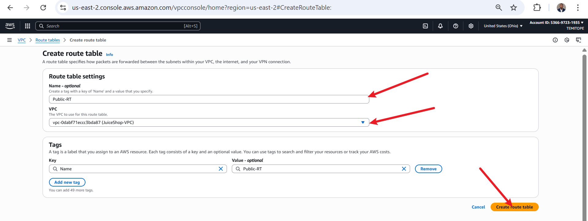
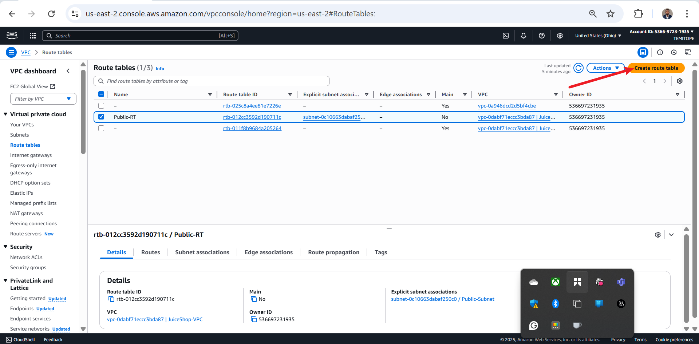

# Sprint 1.1: AWS Networking and Security Groups Setup for Juice Shop Security Monitoring

**Author:** Oluwaseun Osunsola

This document details the steps performed to configure the AWS networking infrastructure and security groups for the "End-to-End Security Monitoring with Suricata IPS, AWS CloudWatch & Splunk on OWASP Juice Shop" project during Sprint 1.1 (Day 1). The goal was to establish a VPC, subnets, an internet gateway, route tables, and security groups to support the deployment of the OWASP Juice Shop and Suricata IPS. Each step is linked to a screenshot for reference.

## Prerequisites
- AWS account with permissions to create VPCs, subnets, internet gateways, route tables, and security groups.
- Familiarity with the AWS Management Console.

## Resources Created
### Networking
- **VPC**: `JuiceShop-VPC` (CIDR: `10.0.0.0/16`)
- **Public Subnet**: `Public-Subnet` (CIDR: `10.0.1.0/24`)
- **Private Subnet**: `Private-Subnet` (CIDR: `10.0.2.0/24`)
- **Internet Gateway**: `JuiceShop-IGW` (attached to `JuiceShop-VPC`)
- **Public Route Table**: `JuiceShop-Public-RT` (routes: local + `0.0.0.0/0 → JuiceShop-IGW`)
- **Private Route Table**: `JuiceShop-Private-RT` (routes: local only)

### Security Groups
- **JuiceShop-WebSG** (for OWASP Juice Shop instance)
  - Inbound: HTTP (80), HTTPS (443) from `0.0.0.0/0`; SSH (22) from your IP
  - Outbound: Allow All
- **JuiceShop-IPS-SG** (for Suricata IPS instance)
  - Inbound: HTTP/HTTPS from `JuiceShop-WebSG`; SSH (22) from your IP
  - Outbound: Allow All

## Steps
# Sprint 1.1: AWS Networking and Security Groups Setup for Juice Shop Security Monitoring

**Author:** Oluwaseun Osunsola

This document details the steps performed to configure the AWS networking infrastructure and security groups for the "End-to-End Security Monitoring with Suricata IPS, AWS CloudWatch & Splunk on OWASP Juice Shop" project during Sprint 1.1 (Day 1). The goal was to establish a VPC, subnets, an internet gateway, route tables, and security groups to support the deployment of the OWASP Juice Shop and Suricata IPS. Each step is linked to a screenshot for reference.

## Prerequisites
- AWS account with permissions to create VPCs, subnets, internet gateways, route tables, and security groups.
- Familiarity with the AWS Management Console.

## Resources Created
### Networking
- **VPC**: `JuiceShop-VPC` (CIDR: `10.0.0.0/16`)
- **Public Subnet**: `Public-Subnet` (CIDR: `10.0.1.0/24`)
- **Private Subnet**: `Private-Subnet` (CIDR: `10.0.2.0/24`)
- **Internet Gateway**: `JuiceShop-IGW` (attached to `JuiceShop-VPC`)
- **Public Route Table**: `JuiceShop-Public-RT` (routes: local + `0.0.0.0/0 → JuiceShop-IGW`)
- **Private Route Table**: `JuiceShop-Private-RT` (routes: local only)

### Security Groups
- **JuiceShop-WebSG** (for OWASP Juice Shop instance)
  - Inbound: HTTP (80), HTTPS (443) from `0.0.0.0/0`; SSH (22) from your IP
  - Outbound: Allow All
- **JuiceShop-IPS-SG** (for Suricata IPS instance)
  - Inbound: Custom TCP (8080) from `JuiceShop-WebSG`; SSH (22) from your IP
  - Outbound: Allow All

## Steps

1. **Search for VPC in AWS Console**  
   Searched for "VPC" in the AWS Console's service search bar to access the VPC dashboard.  
   

2. **Click on VPC (Virtual Private Cloud)**  
   From the search results, clicked on "VPC" to access the VPC dashboard.  
   _and_click_on_it.png)

3. **Open VPC Dashboard → Create VPC**  
   Landed on the VPC dashboard and clicked "Create VPC" to start network setup.  
   

4. **Choose “VPC only”, add tag**  
   Selected "VPC only," named it `JuiceShop-VPC`, and added a tag.  
   

5. **Set CIDR IPv4 and create VPC**  
   Set the IPv4 CIDR block to `10.0.0.0/16`, left other settings at default, and clicked "Create VPC."  
   

6. **VPC successfully created → Go to Subnets**  
   Verified that `JuiceShop-VPC` was created and navigated to the subnets page.  
   

7. **On Subnets page, click Create Subnet**  
   On the subnets page, clicked "Create subnet" to define `Public-Subnet` and `Private-Subnet`.  
   

8. **Select JuiceShop-VPC for subnet creation**  
   Selected `JuiceShop-VPC` and proceeded to subnet settings.  
   _scroll_to_subnet_setting_to_add_public_subnet.png)

9. **Create Public + Private subnets**  
   Named the first subnet `Public-Subnet`, chose an Availability Zone, set CIDR to `10.0.1.0/24`, clicked "Add new subnet," then named the second subnet `Private-Subnet`, selected the same Availability Zone, and set CIDR to `10.0.2.0/24`.  
   

10. **Confirm Subnets creation**  
    Verified that `Public-Subnet` and `Private-Subnet` were successfully created.  
    _cidr_ipv4_and_click_create_subnet.png)

11. **Subnet successfully created**  
    Confirmed the successful creation of subnets.  
    

12. **On VPC page, click Internet Gateways**  
    On the `JuiceShop-VPC` page, clicked "Internet Gateways" to create `JuiceShop-IGW`.  
    

13. **Click Create Internet Gateway**  
    Landed on the Internet Gateway page and clicked "Create internet gateway."  
    

14. **Name it JuiceShop-IGW and create**  
    Named it `JuiceShop-IGW` and clicked "Create internet gateway."  
    

15. **IGW created → Click Attach to VPC**  
    Verified that `JuiceShop-IGW` was created and clicked "Attach to a VPC."  
    

16. **Select JuiceShop-VPC and attach**  
    Selected `JuiceShop-VPC` and attached `JuiceShop-IGW`.  
    

17. **IGW successfully attached**  
    Verified that `JuiceShop-IGW` was successfully attached to `JuiceShop-VPC`.  
    

18. **Click on Route Tables**  
    Clicked "Route Tables" to configure `JuiceShop-Public-RT` and `JuiceShop-Private-RT`.  
    

19. **On Route Tables page → Create route table**  
    On the route table page, clicked "Create route table."  
    

20. **Name it JuiceShop-Public-RT**  
    Named it `JuiceShop-Public-RT`, selected `JuiceShop-VPC`, and created the route table.  
    

21. **Public RT created → Click Associate Subnet**  
    Noted the default local route (`10.0.0.0/16`) and clicked "Associate subnet" to link `Public-Subnet`.  
    

22. **Click Edit Subnet Associations**  
    Clicked "Edit subnet associations" to proceed.  
    

23. **Select Public Subnet and save**  
    Selected `Public-Subnet` and saved the association.  
    

24. **Association successful**  
    Verified that the association was successful.  
    

25. **Click Edit Route for Public RT**  
    Clicked "Edit routes" to add an internet route for `JuiceShop-Public-RT`.  
    

26. **Add new route ignoring default**  
    Ignored the default local route and clicked "Add route."  
    

27. **Set destination 0.0.0.0/0 → JuiceShop-IGW**  
    Set the destination to `0.0.0.0/0`, selected `JuiceShop-IGW`, and saved changes.  
    

28. **Route update successful**  
    Verified that the route update for `JuiceShop-Public-RT` was successful.  
    

29. **Back to Route Tables → Create Private RT**  
    Navigated back to route tables to create `JuiceShop-Private-RT`.  
    

30. **Click Create Route Table**  
    On the route table page, clicked "Create route table."  
    

31. **Name it JuiceShop-Private-RT**  
    Named it `JuiceShop-Private-RT`, selected `JuiceShop-VPC`, and created the route table.  
    

32. **Private RT created → Associate Subnet**  
    Noted the default local route and clicked "Associate subnet" to link `Private-Subnet`.  
    

33. **Click Edit Subnet Associations**  
    Clicked "Edit subnet associations" to proceed.  
    

34. **Select Private Subnet and save**  
    Selected `Private-Subnet` and saved the association.  
    

35. **Association successful → Back to VPC**  
    Verified that the association was successful and navigated back to the VPC dashboard.  
    

36. **Click on Security Groups**  
    Clicked "Security Groups" to configure access rules for `JuiceShop-WebSG` and `JuiceShop-IPS-SG`.  
    

37. **Ignore default → Create Security Group**  
    Ignored the default security group and clicked "Create security group."  
    

38. **Name it JuiceShop-WebSG and add description**  
    Named it `JuiceShop-WebSG`, added a description, selected `JuiceShop-VPC`, and proceeded to configure rules.  
    

39. **Add inbound rules HTTP/SSH → Create SG**  
    Added HTTP (80) and HTTPS (443) from `0.0.0.0/0`, SSH (22) from your IP, left outbound as "Allow All," and created the security group.  
    _and_ssh(only_my_pc)_leave_outbound_and_create_security_group.png)

40. **WebSG created successfully**  
    Verified that `JuiceShop-WebSG` was successfully created.  
    

41. **Click on VPC**  
    Clicked "VPC" to continue configuring security groups.  
    

42. **Click on Security Groups again**  
    Clicked "Security Groups" to create `JuiceShop-IPS-SG`.  
    

43. **Note WebSG in list → Create SG**  
    Noted that `JuiceShop-WebSG` appeared in the list and clicked "Create security group" for Suricata.  
    

44. **Name it JuiceShop-IPS-SG and add description**  
    Named it `JuiceShop-IPS-SG`, added a description, selected `JuiceShop-VPC`, and proceeded to configure rules.  
    

45. **Add inbound rule (custom TCP 8080 from WebSG)**  
    Added Custom TCP (8080) with the source set to `JuiceShop-WebSG`, SSH (22) from your IP, set outbound to "Allow All," and created the security group.  
    

46. **IPS-SG created successfully**  
    Verified that `JuiceShop-IPS-SG` was successfully created.  
    

47. **Click on Security Groups to confirm**  
    Clicked "Security Groups" to confirm the creation of `JuiceShop-IPS-SG`.  
    

     and `Private-Subnet` (`10.0.2.0/24`).
- **Internet Gateway**: `JuiceShop-IGW` attached to `JuiceShop-VPC`.
- **Route Tables**:
  - `JuiceShop-Public-RT`: Routes local traffic and `0.0.0.0/0` to `JuiceShop-IGW`, associated with `Public-Subnet`.
  - `JuiceShop-Private-RT`: Routes local traffic only, associated with `Private-Subnet`.
- **Security Groups**:
  - `JuiceShop-WebSG`: Allows HTTP (80), HTTPS (443) from anywhere, SSH (22) from your IP.
  - `JuiceShop-IPS-SG`: Allows Custom TCP (8080) from `JuiceShop-WebSG`, SSH (22) from your IP.

This setup provides a secure and isolated network environment for deploying the OWASP Juice Shop and Suricata IPS in subsequent sprints.
1. **Navigate to VPC Dashboard**  
   Searched for "VPC" in the AWS Console's service search bar to access the VPC dashboard.  
   

2. **Access VPC Creation Page**  
   From the VPC dashboard, clicked "Create VPC" to begin network setup.  
   _and_click_on_it.png)

3. **Create VPC**  
   Selected "VPC only," named it `JuiceShop-VPC`, set the IPv4 CIDR block to `10.0.0.0/16`, and left other settings at default. Clicked "Create VPC."  
   

4. **Confirm VPC Creation**  
   Verified that `JuiceShop-VPC` was successfully created. Navigated to the subnets page.  
   

5. **Access Subnet Creation**  
   On the subnets page, clicked "Create subnet" to define `Public-Subnet` and `Private-Subnet`.  
   

6. **Select VPC for Subnets**  
   Selected `JuiceShop-VPC` and proceeded to subnet settings to add `Public-Subnet`.  
   

7. **Configure Public Subnet**  
   Named the subnet `Public-Subnet`, chose an Availability Zone, set the CIDR block to `10.0.1.0/24`, and clicked "Add new subnet" to configure `Private-Subnet`.  
   _scroll_to_subnet_setting_to_add_public_subnet.png)

8. **Configure Private Subnet**  
   Named the subnet `Private-Subnet`, selected the same Availability Zone, set the CIDR block to `10.0.2.0/24`, and clicked "Create subnet."  
   

9. **Confirm Subnet Creation**  
   Verified that `Public-Subnet` and `Private-Subnet` were successfully created.  
   _cidr_ipv4_and_click_create_subnet.png)

10. **Navigate to Internet Gateway**  
    On the `JuiceShop-VPC` page, clicked "Internet Gateways" to create `JuiceShop-IGW`.  
    

11. **Create Internet Gateway**  
    Landed on the Internet Gateway page and clicked "Create internet gateway."  
    

12. **Configure Internet Gateway**  
    Named it `JuiceShop-IGW` and clicked "Create internet gateway."  
    

13. **Confirm Internet Gateway Creation**  
    Verified that `JuiceShop-IGW` was created and clicked "Attach to a VPC."  
    

14. **Attach Internet Gateway to VPC**  
    Selected `JuiceShop-VPC` and attached `JuiceShop-IGW`.  
    

15. **Confirm Internet Gateway Attachment**  
    Verified that `JuiceShop-IGW` was successfully attached to `JuiceShop-VPC`.  
    

16. **Navigate to Route Tables**  
    Clicked "Route Tables" to configure `JuiceShop-Public-RT` and `JuiceShop-Private-RT`.  
    

17. **Create Public Route Table**  
    On the route table page, clicked "Create route table."  
    

18. **Configure Public Route Table**  
    Named it `JuiceShop-Public-RT`, selected `JuiceShop-VPC`, and created the route table.  
    

19. **Associate Public Subnet**  
    Noted the default local route (`10.0.0.0/16`) allowing communication within `JuiceShop-VPC`. Clicked "Associate subnet" to link `Public-Subnet`.  
    

20. **Edit Subnet Associations**  
    Clicked "Edit subnet associations" to proceed.  
    

21. **Select Public Subnet**  
    Selected `Public-Subnet` and saved the association.  
    

22. **Confirm Public Subnet Association**  
    Verified that the association was successful.  
    

23. **Edit Public Route Table**  
    Clicked "Edit routes" to add an internet route for `JuiceShop-Public-RT`.  
    

24. **Add Internet Route**  
    Ignored the default local route, added a route with destination `0.0.0.0/0`, selected `JuiceShop-IGW`, and saved changes.  
    

25. **Confirm Route Update**  
    Verified that the route update for `JuiceShop-Public-RT` was successful.  
    

26. **Create Private Route Table**  
    Navigated back to route tables to create `JuiceShop-Private-RT`.  
    

27. **Configure Private Route Table**  
    Named it `JuiceShop-Private-RT`, selected `JuiceShop-VPC`, and created the route table.  
    

28. **Associate Private Subnet**  
    Noted the default local route for VPC communication. Clicked "Associate subnet" to link `Private-Subnet`.  
    

29. **Edit Private Subnet Associations**  
    Clicked "Edit subnet associations" to proceed.  
    

30. **Select Private Subnet**  
    Selected `Private-Subnet` and saved the association.  
    

31. **Confirm Private Subnet Association**  
    Verified that the association was successful and navigated back to the VPC dashboard.  
    

32. **Navigate to Security Groups**  
    Clicked "Security Groups" to configure access rules for `JuiceShop-WebSG` and `JuiceShop-IPS-SG`.  
    

33. **Create Security Group for Juice Shop**  
    Ignored the default security group and clicked "Create security group."  
    

34. **Configure Juice Shop Security Group**  
    Named it `JuiceShop-WebSG`, added a description, selected `JuiceShop-VPC`, and proceeded to configure rules.  
    

35. **Add Inbound Rules for Juice Shop**  
    Added HTTP (80) and HTTPS (443) from `0.0.0.0/0`, and SSH (22) from your IP. Left outbound rules as "Allow All" and created the security group.  
    

36. **Confirm Juice Shop Security Group Creation**  
    Verified that `JuiceShop-WebSG` was successfully created.  
    

37. **Navigate to VPC Dashboard**  
    Clicked "VPC" to continue configuring security groups.  
    

38. **Access Security Groups Again**  
    Clicked "Security Groups" to create `JuiceShop-IPS-SG`.  
    _and_ssh(only_my_pc)_leave_outbound_and_create_security_group.png)

39. **Confirm Juice Shop Security Group in List**  
    Noted that `JuiceShop-WebSG` appeared in the list and clicked "Create security group" for Suricata.  
    

40. **Configure Suricata Security Group**  
    Named it `JuiceShop-IPS-SG`, added a description, selected `JuiceShop-VPC`, and proceeded to configure rules.  
    

41. **Add Inbound Rules for Suricata**  
    Added HTTP (80) and HTTPS (443) with the source set to `JuiceShop-WebSG`, and SSH (22) from your IP. Set outbound to "Allow All" and created the security group.  
    

42. **Confirm Suricata Security Group Creation**  
    Verified that `JuiceShop-IPS-SG` was successfully created.  
    

43. **Verify All Security Groups**  
    Confirmed that both `JuiceShop-WebSG` and `JuiceShop-IPS-SG` were listed.  
    

## Outcome
The AWS networking infrastructure and security groups were successfully configured:
- **VPC**: `JuiceShop-VPC` with CIDR `10.0.0.0/16`.
- **Subnets**: `Public-Subnet` (`10.0.1.0/24`) and `Private-Subnet` (`10.0.2.0/24`).
- **Internet Gateway**: `JuiceShop-IGW` attached to `JuiceShop-VPC`.
- **Route Tables**:
  - `JuiceShop-Public-RT`: Routes local traffic and `0.0.0.0/0` to `JuiceShop-IGW`, associated with `Public-Subnet`.
  - `JuiceShop-Private-RT`: Routes local traffic only, associated with `Private-Subnet`.
- **Security Groups**:
  - `JuiceShop-WebSG`: Allows HTTP (80), HTTPS (443) from anywhere, SSH (22) from your IP.
  - `JuiceShop-IPS-SG`: Allows HTTP/HTTPS from `JuiceShop-WebSG`, SSH (22) from your IP.

This setup provides a secure and isolated network environment for deploying the OWASP Juice Shop and Suricata IPS in subsequent sprints.