# Digital Forensic Analysis of a Phishing Email Impersonating DHL

**Author:** Oluwaseun Osunsola    
**Environment:** Windows OS, Chrome Browser & Roundcube Webmail   

**Project link:** https://github.com/Oluwaseunoa/Cybersecurity-Projects/tree/main/Cyber-Security-Fundamentals

This report documents the steps taken during the analysis of a suspicious email claiming to be from DHL. The aim is to determine whether the message was legitimate or a phishing attempt, and to document the investigative process for awareness and training.

## Project Overview

A suspicious email was received with a subject line suggesting an urgent DHL shipment delivery notice. The visual appearance of the email attempted to create a sense of urgency to prompt the recipient to click a link or open an attachment.

This report walks through each step used to verify the authenticity of the email.

## Investigation Steps

### 1. Received Suspicious Email

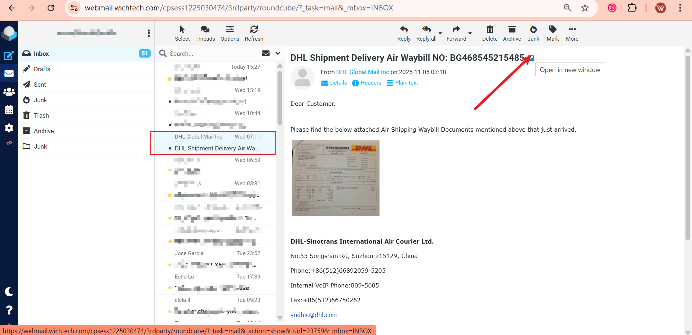
The email subject appeared to reference a DHL shipment, which is a common tactic used in phishing to create urgency.

### 2. Checked Sender Address

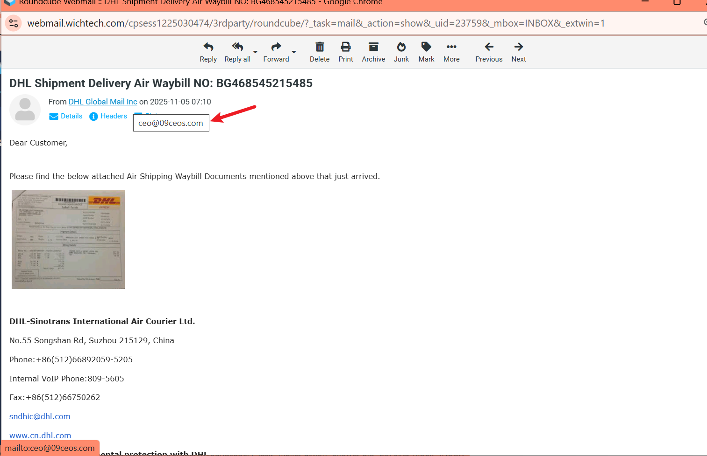
Hovering over the sender name revealed the email domain did not belong to DHL.

### 3. Opened Message Headers

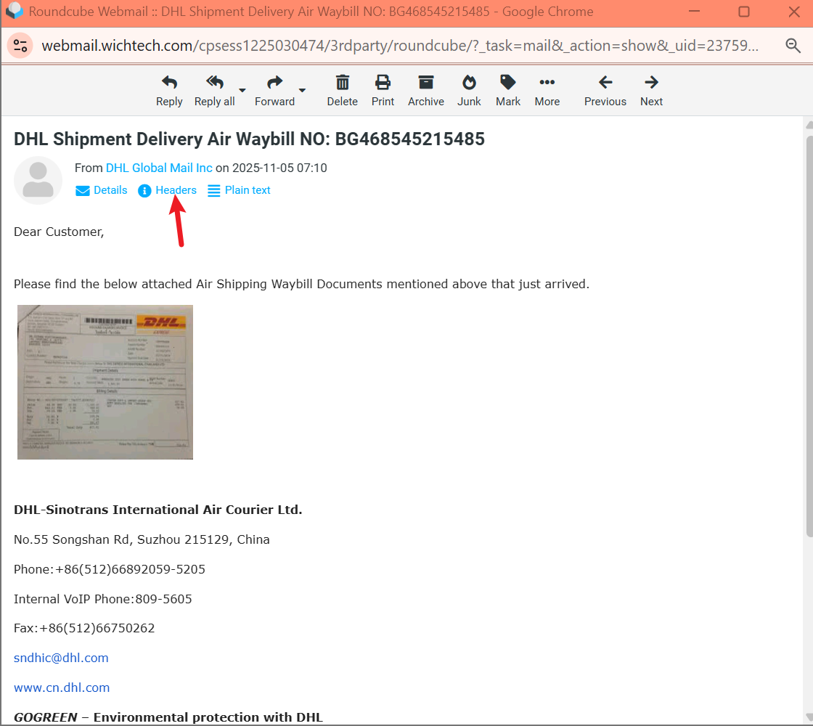
The headers were opened to verify details about the sending server and domain authentication.

### 4. Sender Domain Mismatch

.png)
The "From" address did not match official DHL systems.

### 5. DKIM Signature Review

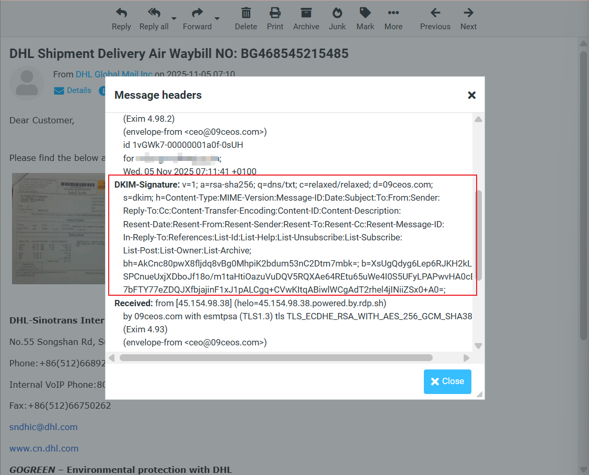
The DKIM signature only verified the domain `09ceos.com`, not DHL.

### 6. Suspicious Mail Routing

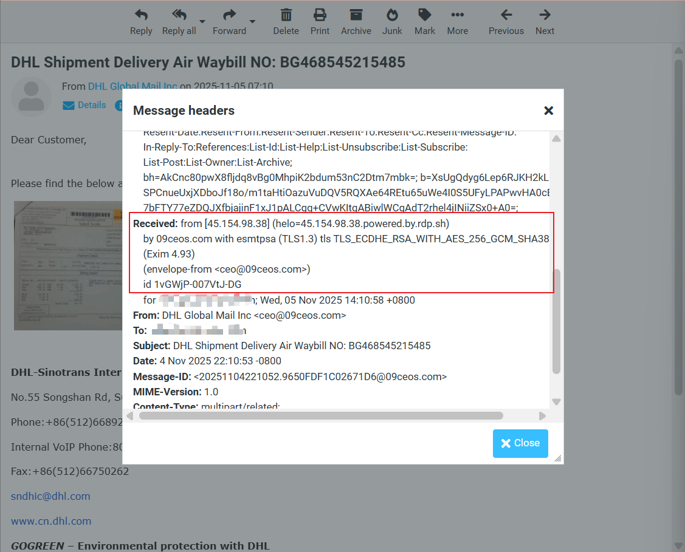
Routing traced through a server associated with compromised RDP hosts.

### 7. Urgent Subject Pattern

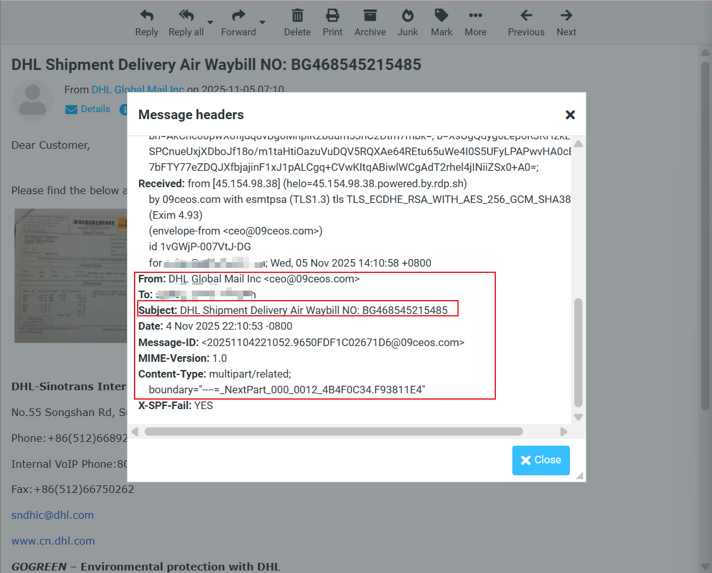
The subject mimicked DHL/FedEx shipment notices, a known phishing tactic.

### 8. SPF Failure Confirmed

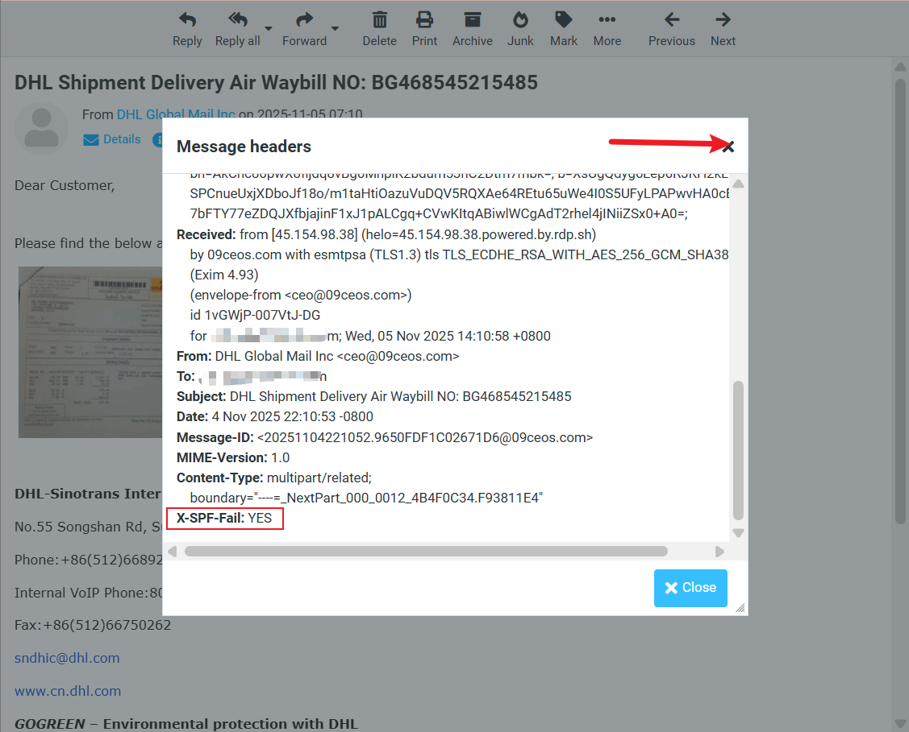
The email failed SPF validation, meaning the sender was not authorized to send from that domain.

### 9. Suspicious Embedded Image Link

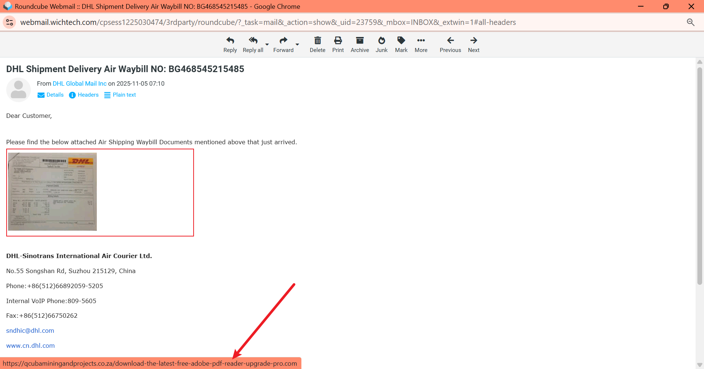
The embedded "document" image contained a dangerous external link.

### 10. Extracted Link for Analysis

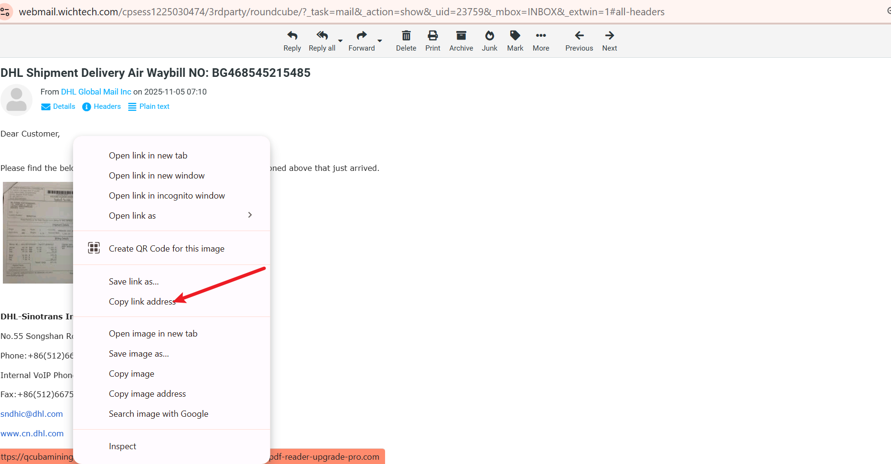.

### 11. Submitted to VirusTotal

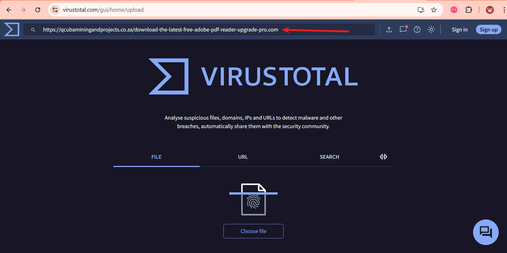
The link was tested using VirusTotal.

### 12. Malicious Detection

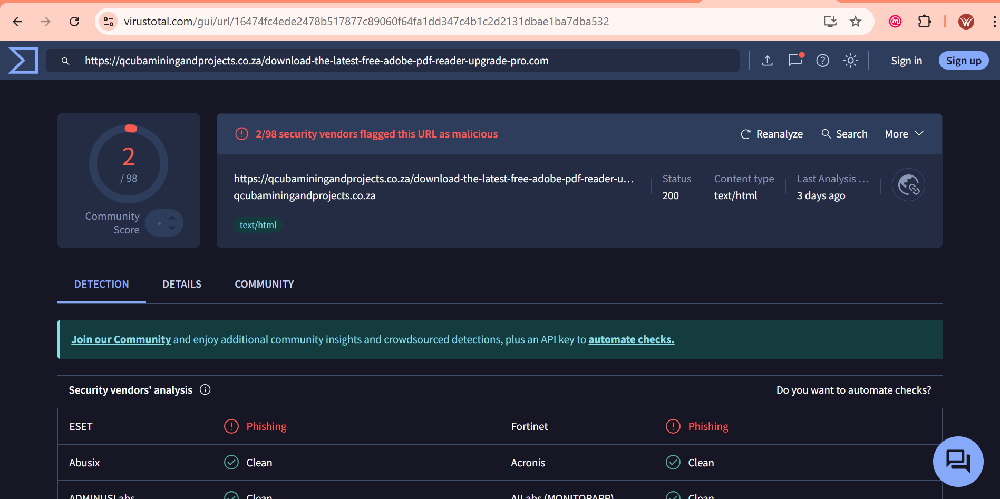
Two security vendors flagged the link as malicious.

### 13. Prior Phishing Confirmation

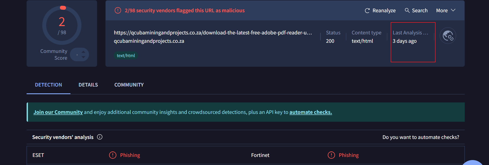
Another user previously identified the link as phishing.

### 14. Additional Malicious Link Found

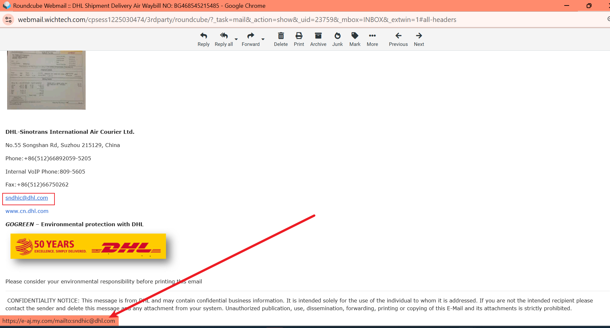
The contact email in the footer was also linked to a known malicious domain.

### 15. Fake DHL Link Masking

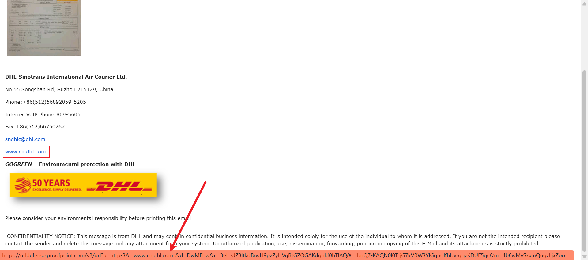
A real DHL link was included to create trust, while malicious links were hidden elsewhere.

### 16. Final Action

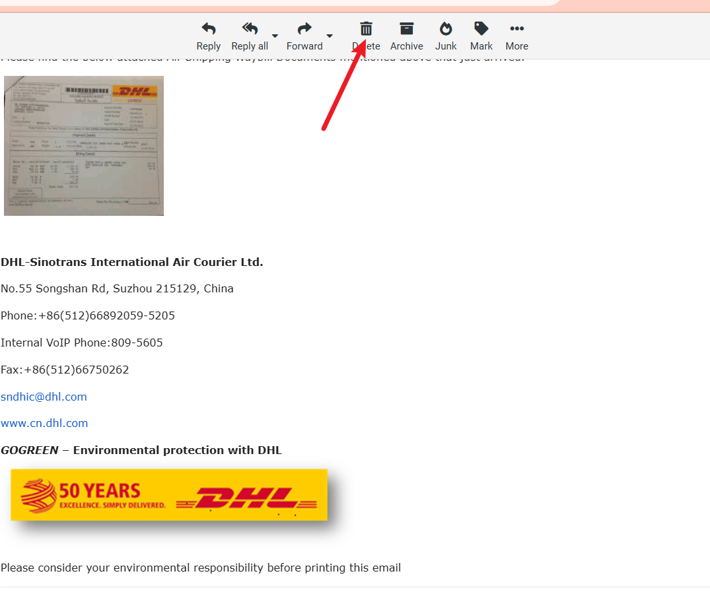
The email was deleted or escalated depending on security policy.

## Conclusion

This email was confirmed to be a phishing attempt. Key indicators included:

* Sender domain mismatch
* SPF authentication failure
* Suspicious routing path
* Malicious link flagged by VirusTotal

### Recommendation

* Do not click suspicious links.
* Always verify sender information.
* Report similar phishing attempts to IT/security.

Below are common terms used in the report explained in plain language:

| Term                                  | Simple Explanation                                                                                                                     |
| ------------------------------------- | -------------------------------------------------------------------------------------------------------------------------------------- |
| **Phishing**                          | A scam where attackers pretend to be someone trustworthy (like a bank or DHL) to trick you into clicking a link or giving information. |
| **Spoofing**                          | When a scammer fakes an email address or name to make it look real.                                                                    |
| **Email Header**                      | The hidden technical details of an email that show where it came from and the servers it passed through.                               |
| **Domain**                            | The website or email company's name, e.g., `dhl.com`. Fake emails often use similar-looking domains.                                   |
| **SPF (Sender Policy Framework)**     | A security check that verifies if an email is allowed to be sent from a domain. If it **fails**, the sender is likely fake.            |
| **DKIM (DomainKeys Identified Mail)** | Another security check that verifies if an email was modified or faked during transit.                                                 |
| **Malicious Link**                    | A link designed to cause harm — like stealing passwords, downloading viruses, or redirecting to fake websites.                         |
| **VirusTotal**                        | A website that checks whether a link or file is safe by comparing it to many security databases.                                       |
| **Urgency-Based Attack**              | A scam technique where the attacker tries to make you panic and act quickly (like “urgent shipment notice”).                           |
| **Social Engineering**                | The psychological manipulation of people to trick them into unsafe decisions.                                                          |

