# Understanding and Implementing Digital Signatures and Public Key Distribution

**Author:** Oluwaseun Osunsola  
**Environment:** Kali Linux (CLI-based)  
**Project link:** https://github.com/Oluwaseunoa/Cyber-Security-Projects/tree/main/Cyber-Security-Fundamentals/Steganography-Project

## 📌 Project Objective
The goal of this project is to:
- Understand how **digital signatures** work.
- Learn how to **generate key pairs** using GPG.
- Sign and verify messages using public–private key cryptography.
- Share public keys securely.
- Test the integrity verification feature by detecting tampered messages.

---

## 🛠 Tools Used
- **Operating System:** Kali Linux  
- **Software:** GPG (GNU Privacy Guard)  
- **Text Editor:** nano  
- **Terminal:** Bash Shell

---

## 📂 Project Structure
```

Digital-Signature-and-PKI/
├── img/                          # All project screenshots
├── Temmy_Download/               # Files that Temmy received
├── message.txt                   # Original message file
├── public_key.asc                # Exported public key
├── README.md                     # This project report
└── signed_message.sig            # Signed message file


````

---

## 🧩 Project Steps

### **Step 1: Generate a GPG Key Pair**
We start by generating a public–private key pair.  
Command:
```bash
gpg --full-generate-key
````

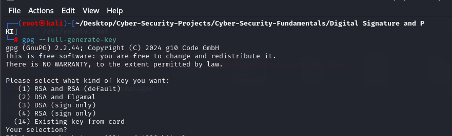

---

### **Step 2: Choose Key Length**

For stronger encryption, `4096` bits should be chosen but we'll go with the default 3072 bits.


---

### **Step 3: Set Key Validity Period**

We set the key to be forever valid by choosing **0**.
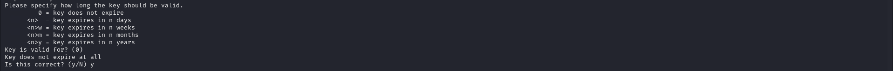

---

### **Step 4: Identity Construction**

We provided:

* Name: Oluwaseun Osunsola
* Email: `oluwaseun.beicks@gmail.com` 
  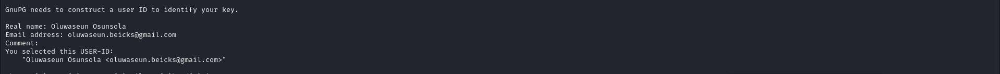

---

### **Step 5: Final Options and Passphrase Choice**

We confirmed the key type, length, validity, and then set a strong passphrase to protect the private key.
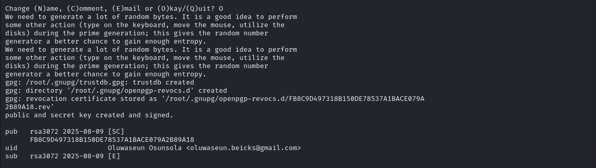

---

### **Step 6: Create a Message**

We created a text file with a confidential message:

```bash
echo "This is a confidential memo from Seun to Temmy" > message.txt
cat message.txt
```

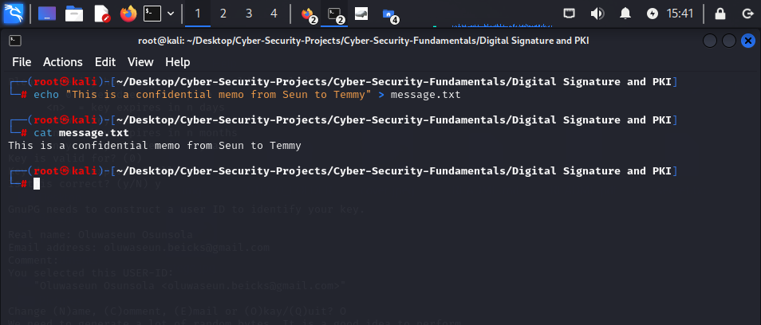

---

### **Step 7: Sign the Message**

We signed the message using:

```bash
gpg --armor --output signed_message.sig --sign message.txt
```

This produced a `.sig` file containing the message and its signature.
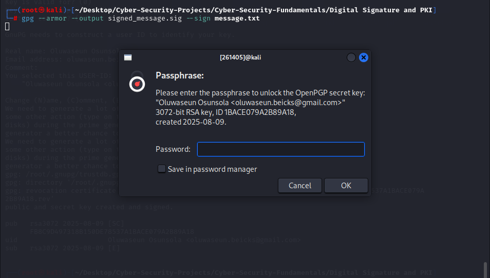

---

### **Step 8: List Keys**

To confirm our key exists in the local GPG keyring:

```bash
gpg --list-keys
```

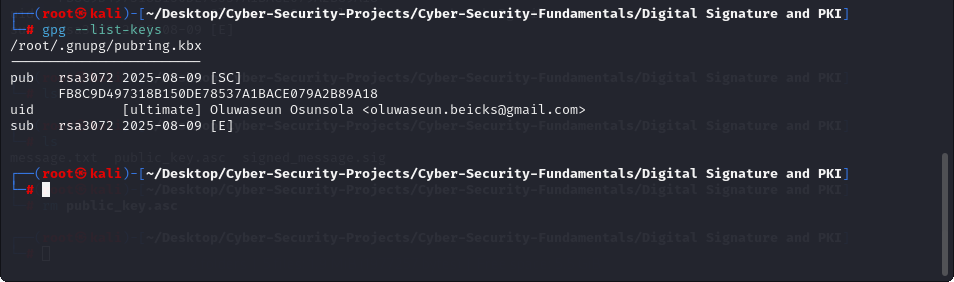

---

### **Step 9: Export Public Key**

We exported the public key linked to our email:

```bash
gpg --armor --export oluwaseun.beicks@gmail.com > public_key.asc
```

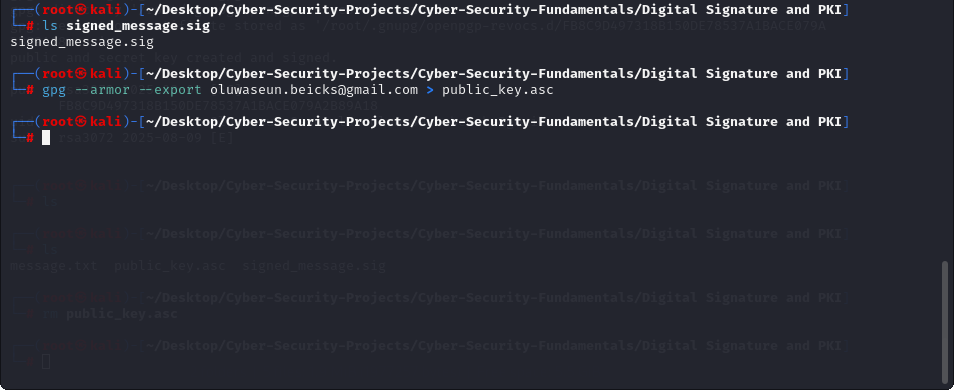

---

### **Step 10: Verify the Key Export**

We checked that the `public_key.asc` file exists and contains the ASCII-armored key.
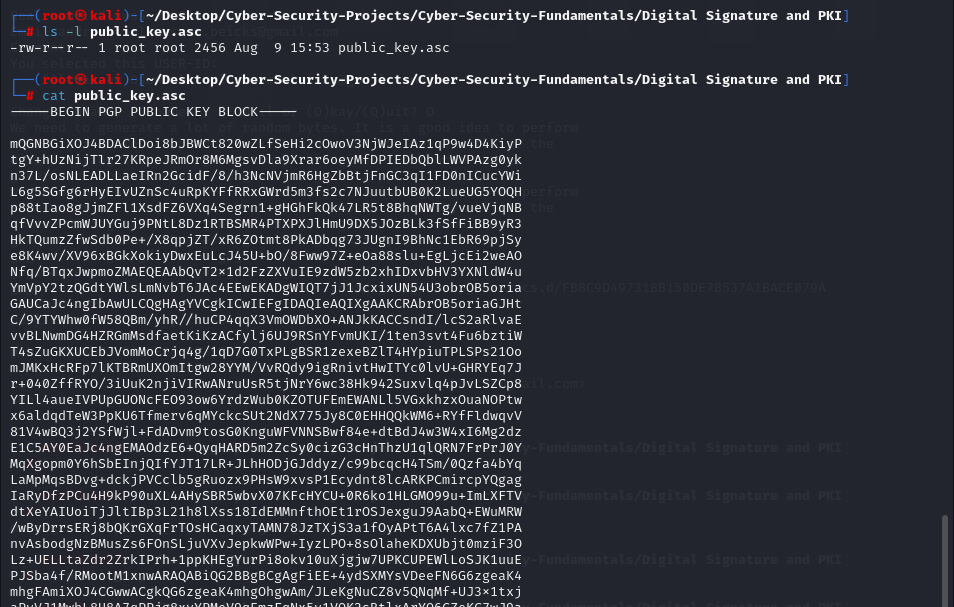

---

### **Step 11: Send Files to Receiver**

We sent **two files** to Temmy (acting as Alice in this simulation):

* `public_key.asc`
* `signed_message.sig`
  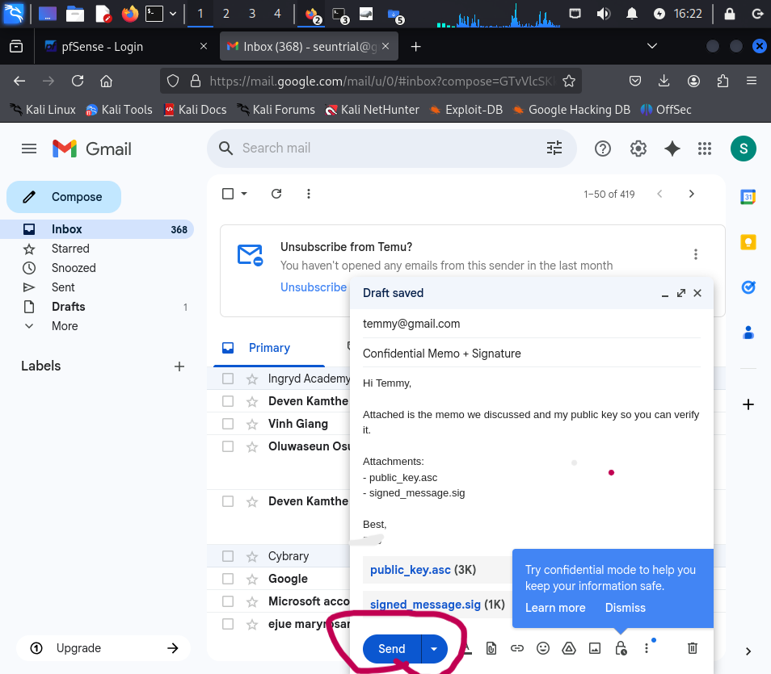

---

## 🧩 Receiver's (Temmy’s) Steps

### **Step 12: Download Files**

Temmy downloads both files into her `Downloads` folder.


---

### **Step 13: Open Downloads Folder in Terminal**

She navigates to the Downloads folder via terminal.
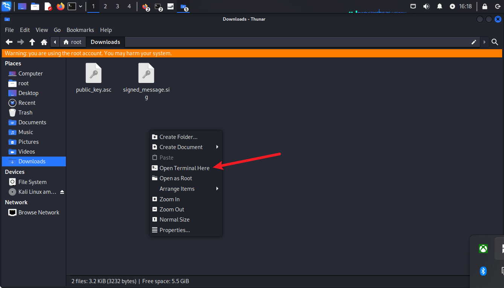

---

### **Step 14: Import Public Key**

Temmy imports Oluwaseun’s public key:

```bash
gpg --import public_key.asc
```

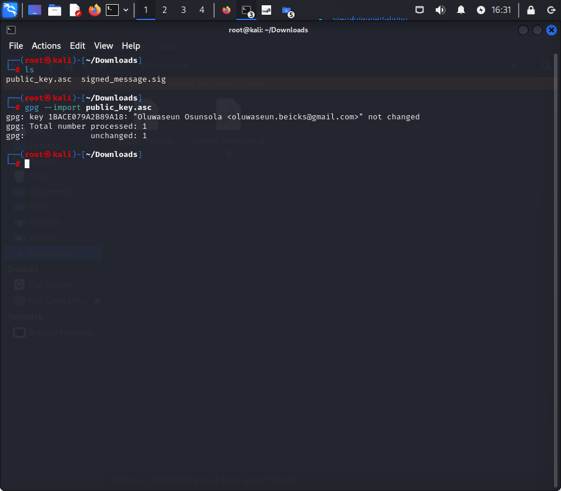

---

### **Step 15: Verify the Signature**

Temmy verifies that the signed file was indeed signed by Oluwaseun:

```bash
gpg --verify signed_message.sig
```

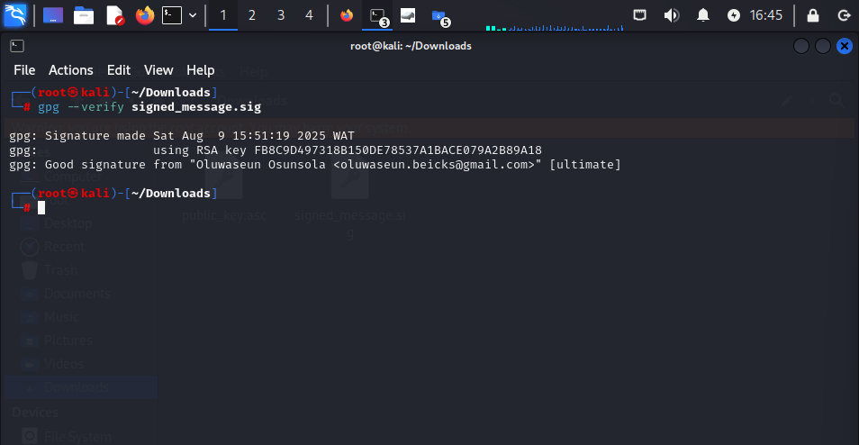

---

## 🔍 Integrity Testing

### **Step 16: Open Signed Message**

Temmy opens the signed file in nano.
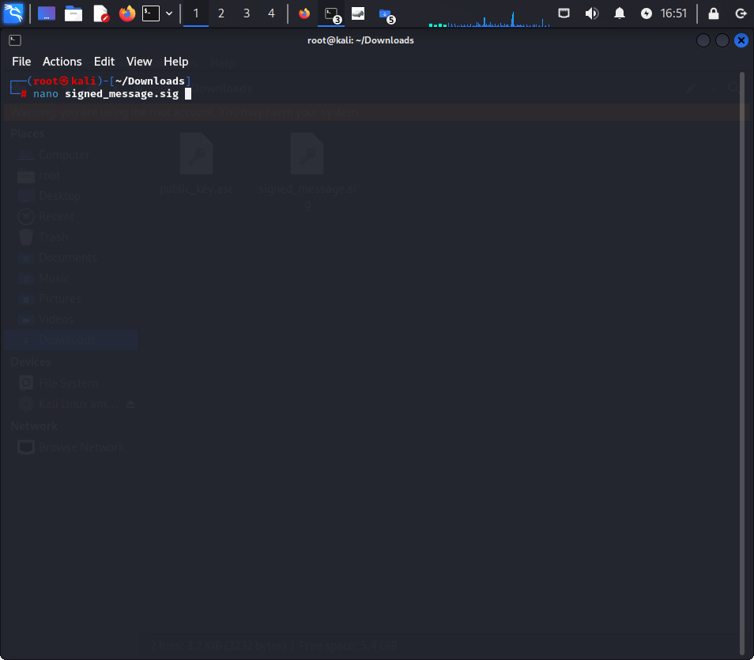

---

### **Step 17: View Signed Message Content**

The content is in ASCII-armored format (encoded and compressed message + signature).


---

### **Step 18: Tamper with the File**

Temmy deletes some characters from the encoded message block.
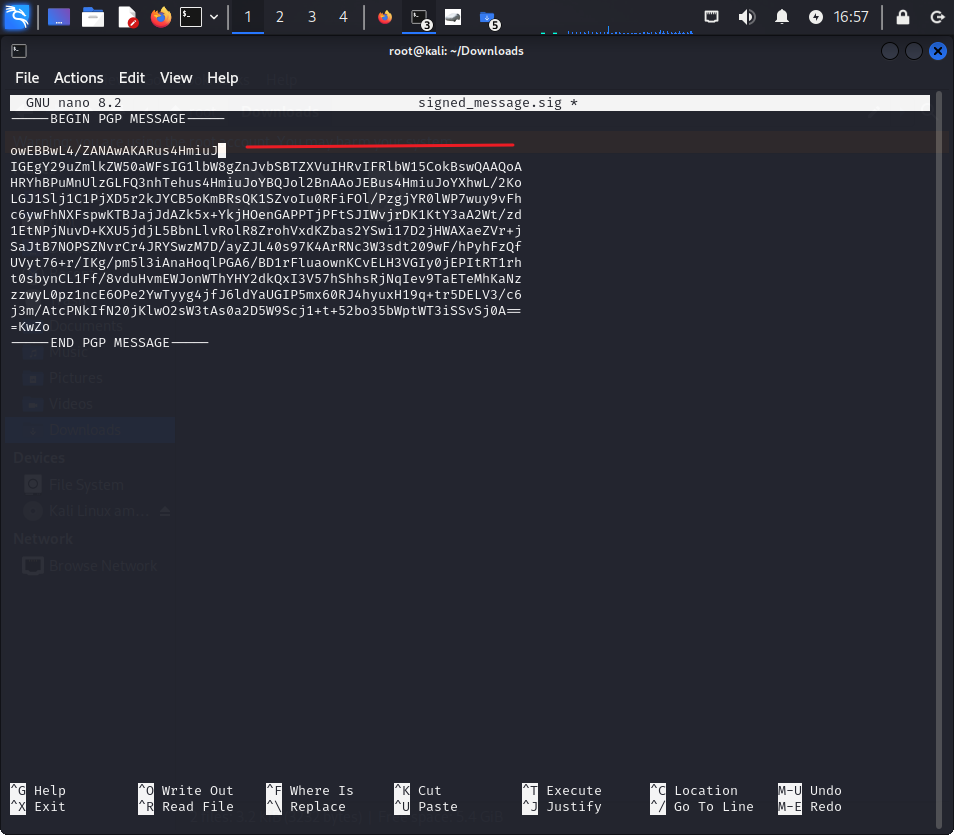

---

### **Step 19: Verify Again — Failure**

After tampering, GPG detects corruption:

```bash
gpg --verify signed_message.sig
```

Output:

```
gpg: CRC error...
gpg: the signature could not be verified.
```

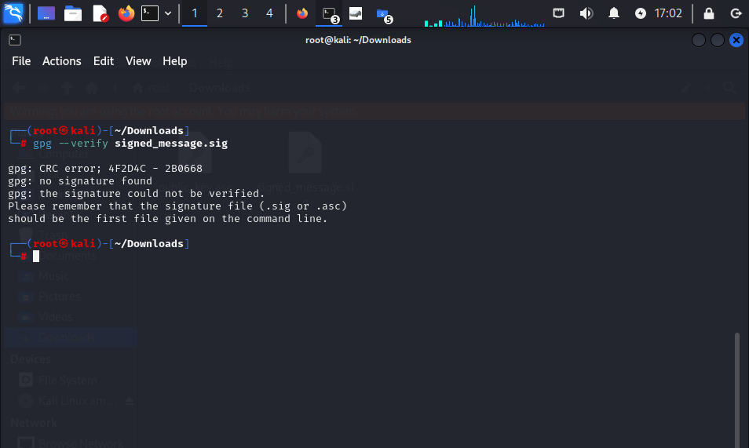

This confirms that **any alteration** to the signed content invalidates the signature.

---

## 📊 Learning Outcomes

* Learned how to **generate GPG keys** securely.
* Understood **public–private key encryption** and **digital signatures**.
* Practiced **signing** and **verifying** messages.
* Understood the importance of **key sharing** and **integrity verification**.
* Saw how **tampering** invalidates a signature.

---

## 💡 Real-World Applications

* **Secure email signing** (PGP, S/MIME)
* **Software distribution** (verifying signed binaries)
* **Git commit signing** (to prevent commit forgery)
* **Document authenticity checks** (contracts, agreements)

---


