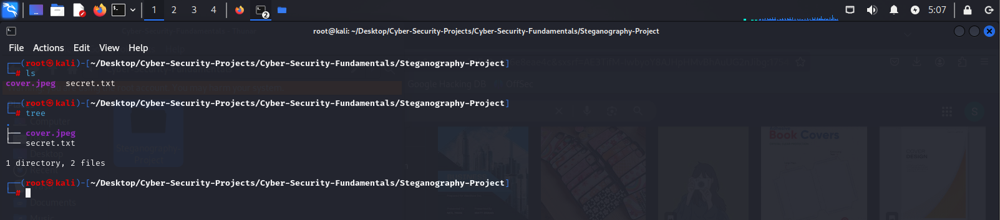

Here's a comprehensive **README.md** for your steganography project, structured with clear sections and incorporating all your screenshots in a logical flow:

---

# **Steganography Project**  
**Hide Secret Messages in JPEG Images**  

## **Table of Contents**  
1. [Introduction](#introduction)  
2. [Project Structure](#project-structure)  
3. [Prerequisites](#prerequisites)  
4. [Usage Guide](#usage-guide)  
   - [Step 1: Prepare Files](#step-1-prepare-files)  
   - [Step 2: Embed Secret Data](#step-2-embed-secret-data)  
   - [Step 3: Verify Output](#step-3-verify-output)  
   - [Step 4: Extract Hidden Data](#step-4-extract-hidden-data)  
5. [Screenshots](#screenshots)  
6. [Technical Details](#technical-details)  
7. [License](#license)  

---

### **Introduction**  
This project demonstrates **steganography**—the practice of hiding secret data within an ordinary file (e.g., a JPEG image). The process ensures the carrier file (cover image) appears unchanged while securely storing the hidden message.  

Key Features:  
- Hide text (`secret.txt`) inside a JPEG (`cover.jpg`).  
- Generate a new stego-image (`stego.jpg`) with the embedded data.  
- Verify integrity by comparing file sizes and hash digests.  
- Extract the hidden message from `stego.jpg`.  

---

### **Project Structure**  
The project directory is organized as follows:  
```
/steganography-project  
│── cover.jpg               # Original JPEG image (carrier file)  
│── secret.txt              # Text file containing the secret message  
│── stego.jpg               # Output image with hidden data  
│── /STEGO_FOLDER           # Subfolder for organized output (optional)  
```  

**Screenshots:**  
1. `project_folder_on_cli.png` - CLI view of the project folder.  

2. `project_folder_in_gui.png` - GUI view of the project folder.  

---

### **Prerequisites**  
- Linux/macOS terminal (or Windows with WSL).  
- Python 3.x + [steghide](http://steghide.sourceforge.net/) (install via `sudo apt-get install steghide`).  
- Basic knowledge of CLI commands.  

---

### **Usage Guide**  

#### **Step 1: Prepare Files**  
1. **Check the secret file:**  
   - Open `secret.txt` (`open_secret-txt.png`).  
   - Verify its size (`stat_secret-txt_before_steg.png`).  

2. **Inspect the cover image:**  
   - Open `cover.jpg` (`open_cover-jpeg.png`).  
   - Check metadata (`stat_cover-jpeg.png`).  

#### **Step 2: Embed Secret Data**  
Run the steganography command:  
```bash  
steghide embed -cf cover.jpg -sf stego.jpg -ef secret.txt  
```  
**Screenshots:**  
- `steg_command.png` - Command execution.  
- `steg-jpg_creation_confirmed_cli.png` - CLI confirmation.  
- `steg-jpg_creation_confirmed_gui.png` - GUI confirmation.  

#### **Step 3: Verify Output**  
1. Open `stego.jpg` (`open_stego-jpg.png`).  
2. Compare file sizes/hashes (`compare_size_and_hash_digest_of_cover-jpeg_with_stego-jpeg.png`).  

#### **Step 4: Extract Hidden Data**  
1. Move `stego.jpg` to a subfolder (`move_stego-jpg_to_new_subfolder.png`).  
2. Navigate to `/STEGO_FOLDER` (`navigate_to_new_the_STEGO_FOLDER.png`).  
3. Extract the message:  
   ```bash  
   steghide extract -sf stego.jpg  
   ```  
   **Screenshot:** `extract_stego-jpg.png`.  

---

### **Technical Details**  
- **Algorithm:** steghide uses advanced encryption (AES) and checksum verification.  
- **Limitations:**  
  - JPEG only (no PNG/MP3 support).  
  - Large files may distort the cover image.  

---

### **License**  
This project is open-source under the [MIT License](LICENSE).  

--- 

**Notes:**  
- Replace `LICENSE` with your actual license file if needed.  
- Adjust paths/commands if your setup differs.  

Let me know if you'd like to add/remove any sections!