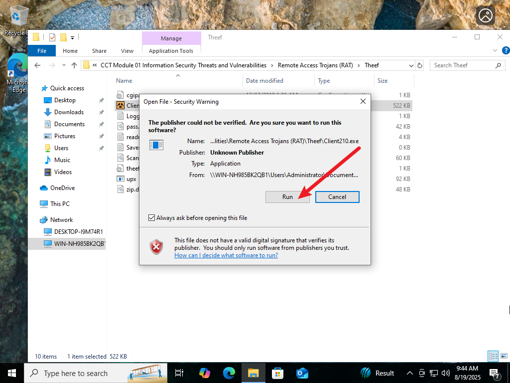

# Red Team Project: Remote Access Trojan with Theef
**Author:** Oluwaseun Osunsola  
**Environment:** Windows   
**Project Link:** https://github.com/Oluwaseunoa/Cybersecurity-Projects/tree/main/Red-Teaming/Malware-Attack-Projects/Remote-Access-Trojan

## Overview 
This project showcases a controlled simulation of a Remote Access Trojan (RAT) attack using the Theef tool. The goal is to demonstrate a red team scenario where an attacker compromises a victim machine to perform reconnaissance and malicious activities like process monitoring and keylogging. The environment is built using VMware Pro, with Windows 10 as the attacker, Windows Server 2022 as the victim, and pfSense as the firewall for network control.

## Environment and Tools

**Virtualization:** VMware Pro  
**Attacker Machine:** Windows 10  
**Victim Machine:** Windows Server 2022  
**Firewall:** pfSense  
**RAT Tool:** Theef (version 2.10, including server210.exe and client210.exe)  

The setup uses a shared network drive for tool distribution and assumes permissive pfSense firewall rules to allow Theef’s default FTP and connection ports.

---

## Project Steps

### 1. Identify Attacker and Victim Machines
Designate Windows 10 as the attacker and Windows Server 2022 as the victim.  
_and_victim_machine(windows_server2022).png)

---

### 2. Snapshot Victim Machine
Take a clean snapshot of the Windows Server 2022 (victim) for rollback if needed.  
.png)  

---

### 3. Enable Firewall
Power on the pfSense firewall and configure it to permit traffic between attacker and victim.  
_is_powered_on.png)

---

### 4. Access Victim Machine
Log in to the powered-on Windows Server 2022 (victim).  
_and_log_in.png)

---

### 5. Install Theef Server on Victim
Locate the Theef RAT folder, run `server210.exe`, and bypass the security warning. The server runs in the background.  
  
  
  

---

### 6. Access Attacker Machine
Log in to the powered-on Windows 10 (attacker).  
_and_log_in.png)

---

### 7. Install Theef Client on Attacker
Locate the Theef RAT folder in the shared drive, run `client210.exe`, and bypass the security warning.  
  
  
  

---

### 8. Establish Connection to Victim
Enter the victim’s IP, keep default FTP and port settings, and connect.  
  

---

### 9. Enter Spy Mode
Click the Spy icon to access attack options.  
  

---

### 10. Monitor Victim Processes
Use Task Manager to view running processes on the victim, verify on the victim machine, and close Task Manager on the attacker.  
  
  
_to_confirm.png)  
_and_close_task_manager.png)

---

### 11. Start Keylogging
Activate the keylogger and start logging keystrokes.  
  

---

### 12. Simulate Activity on Victim
On the victim machine, open WordPad and type text.  
  

---

### 13. Check Logged Keys
Return to the attacker machine to view captured keystrokes and close the keylogger.  
  

---

## Observations
- Theef RAT successfully connected the attacker to the victim, bypassing basic pfSense rules (due to permissive settings for testing).  
- Task Manager provided visibility into victim processes.  
- Keylogging captured real-time keystrokes, showing data exfiltration risks.  
- VMware snapshots ensured a safe testing environment.  

## Recommendations
- Deploy antivirus and endpoint detection to block RAT executables.  
- Tighten pfSense rules to restrict unknown ports and monitor traffic.  
- Conduct such tests only in isolated, authorized environments to avoid ethical or legal issues.  

## Conclusion
This project highlights the dangers of RATs like Theef in a controlled red team exercise. The detailed steps demonstrate ease of deployment and underscore the need for strong cybersecurity measures.
